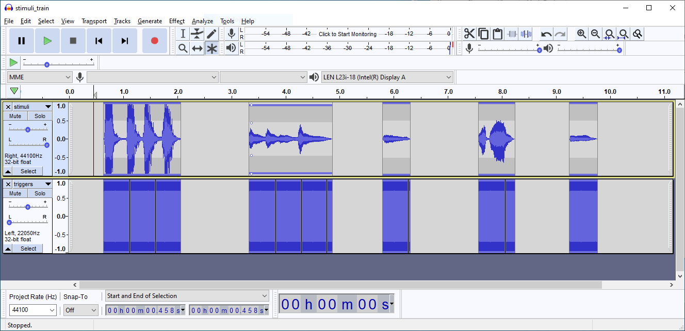

# Audio Splitter Cable

## Purpose
When performing electrophysiological experiments with auditory stimuli, you often want to know precisely when the auditory stimuli is presented to the subject. This is often done with a device such as the g.tec gTRIGbox. If the stimuli have different envelopes, the time it takes for the trigger to occur may vary. This cable removes this possibility and allows you to clearly define what point during your stimuli you want the gTRIGbox to trigger.  

## How to Connect the Hardware
The male end of the 3.5mm audio cable goes into the PC. The black female 3.5mm audio cable connects to the gTRIGbox, and the red female 3.5mm cable goes to headphones. The red connector that goes to headphones has another plug that converts mono to stereo.

## Setting Up the Audio File

You will have to modify the audio stimuli using a program like audacity. The auditory stimuli should be on the right channel, and the trigger (which is a constant frequency beep) should be on the left channel, as shown in the image above. This audio file in its "non-split" form and split form are included in this repository under the name `stimuli_train_non-split.wav` and `stimuli_train_split.wav`, respectively.

Now, when playing back the audio file through the splitter, the beep in the left channel will be routed to the gTRIGbox, and the audio stimuli on the right channel will be converted to stereo and presented through the headphones.
